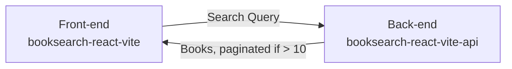

# booksearch-react-vite

Very simple Vite app for book search built with React + TypeScript + Tailwind CSS.

Currently hosted on Vercel: https://booksearch-react-vite.nunogois.com/

Uses [booksearch-react-vite-api](https://github.com/nunogois/booksearch-react-vite-api) as the back-end.

Since I prefer a microservice and decoupled approached compared to setting up monorepos, as always I decided to separate the front-end and back-end in different repos.

## Getting Started

1. Clone the repo: `git clone https://github.com/nunogois/booksearch-react-vite.git`;
2. cd into the folder: `cd booksearch-react-vite`;
3. Install dependencies: `yarn` or `npm install`;
4. Run tests: `yarn test` or `npm run test`;
5. Run the app: `yarn start` or `npm run start`;

Check out [booksearch-react-vite-api](https://github.com/nunogois/booksearch-react-vite-api) and follow its instructions to run the API, so you can run everything together locally.

## Developer Log

Since this is a simple single page application, I will not need routing and other advanced features, so I followed a [YAGNI](https://en.wikipedia.org/wiki/You_aren%27t_gonna_need_it) and [lean](https://en.wikipedia.org/wiki/Lean_software_development) approach as much as possible, which is why I decided to use Vite, and not something like Next.js. Since Vite is so fast, this also means a very good DX (Developer Experience).

I discovered [react-query](https://react-query.tanstack.com/) from a [Fireship video recently](https://www.youtube.com/watch?v=novnyCaa7To) and was also looking for an excuse to try it out.

1. Created a new Vite project: `yarn create vite booksearch-react-vite`;
2. Selected the `react-ts` template;
3. Installed dependencies: `yarn`;
4. Followed [Tailwind CSS official docs](https://tailwindcss.com/docs/guides/vite) to add Tailwind CSS;
5. Installed React Query: `yarn add react-query`;
6. Added Cypress: `yarn add -D cypress @cypress/react @cypress/vite-dev-server` and followed official docs;
7. Cleaned up a bit, removed unnecessary files and code;

The main entrypoint and file for this app will be `src/App.tsx`.

I also took some liberties, like adding a debounce to search and a minimum length. I avoided adding icons, since that would represent extra boilerplate, so I used emotes/chars.

I considered the e2e tests included in the `tests` folder for `App.tsx`, `Book.tsx`, `Books.tsx`, `Filter.tsx` and `Pagination.tsx` to represent a good enough code coverage given the time available.

## Filtering By Star Rating

The original idea was to filter books by the star rating. However, this filtering option is not supported by the Google Books API, so I tried to use the supported filtering options instead: https://developers.google.com/books/docs/v1/using#filtering

I could of course also retrieve a large amount of results and do the filtering by star rating on the front-end after having that information for all results, but that doesn't seem like the best idea for the aim of the project, given that we are also using server-side pagination.

We could also retrieve the top 100 books for our search query, for example in 5 requests of 20 books each, and then filter the results by star rating, but that seems overkill for the current scope.

A long term solution for this could probably involve having a crawl process running on the background, which would retrieve all (or relevant) books from the Google Books API and store them in a database, for example, where we could then have full control.

However, like I said, this falls out of the scope for such a small project.

## Known Bugs

It seems like there's an issue with the totalItems property in the response from the Google Books API: https://stackoverflow.com/questions/7266838/google-books-api-returns-json-with-a-seemingly-wrong-totalitem-value - It returns seemingly random results for each page. Because of that, pagination might break at any moment. That's one of the reasons I limited pagination to 10 pages max.
