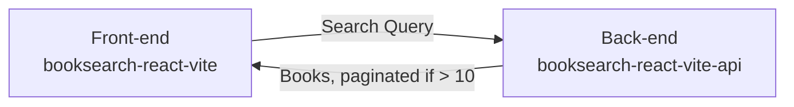

# booksearch-react-vite

Very basic book search app built with React + TypeScript + Vite.
Uses [booksearch-react-vite-api](https://github.com/nunogois/booksearch-react-vite-api) as a proxy API to [Google Books API](https://developers.google.com/books/docs/v1/using).

Since I prefer a microservice and decoupled approached compared to setting up monorepos, as always I decided to separate the front-end and back-end in different repos.

## Developer Log

Since this is a simple single page application, I will not need routing and other advanced features, so I followed a [YAGNI](https://en.wikipedia.org/wiki/You_aren%27t_gonna_need_it) and [lean](https://en.wikipedia.org/wiki/Lean_software_development) approach as much as possible, which is why I decided to use Vite, and not something like Next.js.

Since Vite is super fast, this also means a very good DX (Developer Experience).

I discovered [react-query](https://react-query.tanstack.com/) from a [Fireship video recently](https://www.youtube.com/watch?v=novnyCaa7To) and was also looking for an excuse to try it out.

The main entrypoint and file for this app will be `src/App.tsx`.

1. Created a new Vite project: `yarn create vite booksearch-react-vite`;
2. Selected the `react-ts` template;
3. Installed dependencies: `yarn`;
4. Followed [Tailwind CSS official docs](https://tailwindcss.com/docs/guides/vite) to add Tailwind CSS;
5. Installed React Query: `yarn add react-query`;
6. Cleaned up a bit, removed unnecessary files and code;
7. Proceeded with implementation;

I also took some liberties, like adding a debounce to search and a minimum length. I avoided adding icons, since that would represent extra boilerplate, so I used emotes/chars.

## Known Bugs

It seems like there's an issue with the totalItems property in the response from the Google Books API: https://stackoverflow.com/questions/7266838/google-books-api-returns-json-with-a-seemingly-wrong-totalitem-value - It returns seemingly random results for each page. Because of that, pagination might break at any moment. That's one of the reasons I limited pagination to 10 pages max.

## Getting Started

1. Clone the repo: `git clone https://github.com/nunogois/booksearch-react-vite.git`;
2. cd into the folder: `cd booksearch-react-vite`;
3. Install dependencies: `yarn` or `npm install`;
4. Run tests: `yarn test` or `npm run test`;
5. Run the app: `yarn start` or `npm run start`;

Check out [booksearch-react-vite-api](https://github.com/nunogois/booksearch-react-vite-api) and follow its instructions to run the API, so you can run everything together locally.
